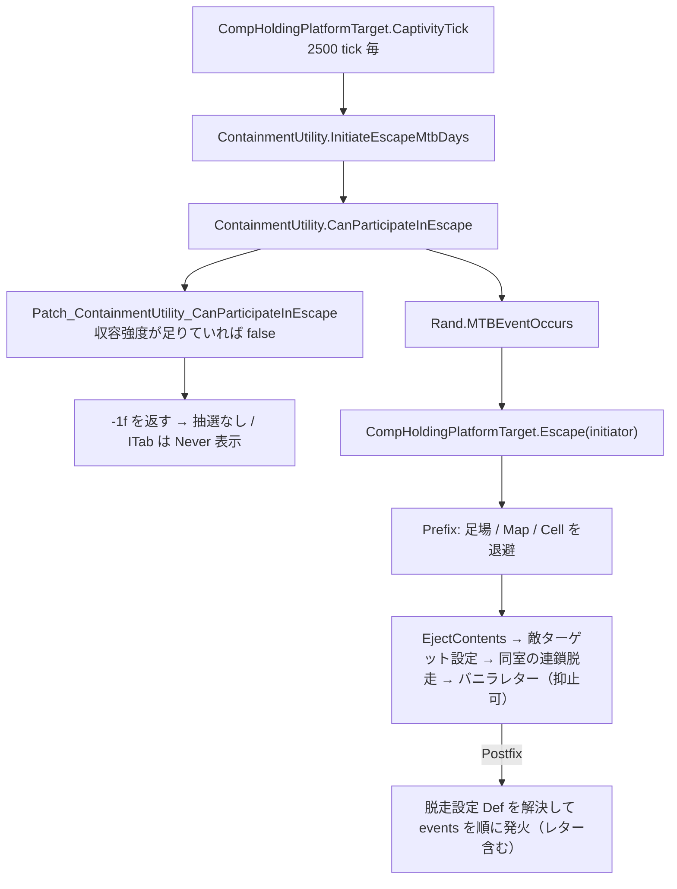
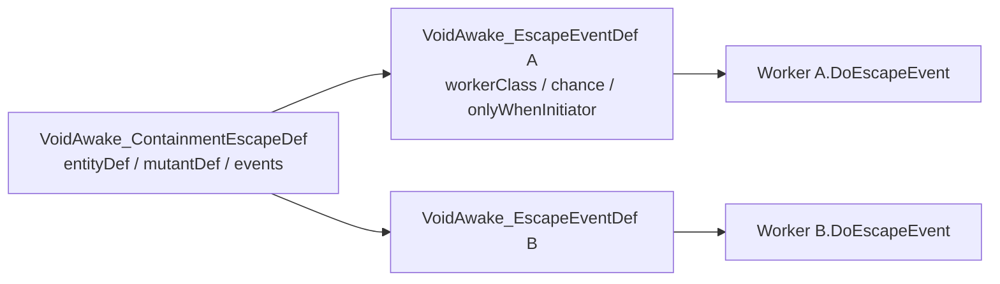

# 収容（脱走）パッチ解説

> 数値と挙動を通しで読める仕様書は [`Containment_Spec.html`](Containment_Spec.html)（ブラウザで開ける単一ファイル）。
>
> 実装メモとして、ファイル構成と設計意図を中心に扱う。
> 脱走イベントのワーカーは現状ほぼ空実装だが、**アノマリー別の脱走レター**は Def で送る。

## 一言でいうと

保持台の**収容強度がエンティティの必要収容強度を満たしていれば、脱走が絶対に発生しなくなる**。バニラでは差が大きいほど脱走間隔が伸びるだけ（最大 8 倍）でゼロにはならなかった。加えて、脱走が起きた場合は**アノマリー種ごとに定義したイベント**が発火する枠を用意した。

---

## 全体構成



| 役割 | パス |
|------|------|
| アノマリー 1 体分の脱走設定（まとめ） | [`Defs/Containment/ContainmentEscapeDefs.xml`](../Defs/Containment/ContainmentEscapeDefs.xml) / [`VoidAwake_ContainmentEscapeDef.cs`](../Source/ClassLibrary1/Core/Containment/VoidAwake_ContainmentEscapeDef.cs) |
| 脱走イベント 1 件の定義 | [`Defs/Containment/EscapeEventDefs.xml`](../Defs/Containment/EscapeEventDefs.xml) / [`VoidAwake_EscapeEventDef.cs`](../Source/ClassLibrary1/Core/Containment/VoidAwake_EscapeEventDef.cs) |
| イベントワーカー基底・脱走時の状況 | [`VoidAwake_EscapeEventWorker.cs`](../Source/ClassLibrary1/Core/Containment/VoidAwake_EscapeEventWorker.cs) |
| アノマリーごとの空スタブ | [`Events/EscapeEventWorkers_Vanilla.cs`](../Source/ClassLibrary1/Core/Containment/Events/EscapeEventWorkers_Vanilla.cs) |
| 収容判定・Def 解決・イベント発火 | [`ContainmentEscapeUtility.cs`](../Source/ClassLibrary1/Core/Containment/ContainmentEscapeUtility.cs) |
| Harmony パッチ | [`Patch_ContainmentEscape.cs`](../Source/ClassLibrary1/Core/Containment/Patch_ContainmentEscape.cs) |
| Dev デバッグ | [`DebugActions_Containment.cs`](../Source/ClassLibrary1/Core/Containment/DebugActions_Containment.cs) |
| 文言 | [`English`](../Languages/English/Keyed/VoidAwake_Containment.xml) / [`Japanese`](../Languages/Japanese/Keyed/VoidAwake_Containment.xml) |

Harmony の登録は既存の [`VoidAwake_PlaySettings_Patch.cs`](../Source/ClassLibrary1/Core/VoidAwake_PlaySettings_Patch.cs) にある `PatchAll()` が拾うため、初期化コードは追加していない。

---

## 脱走阻止の仕組み

バニラの脱走抽選は `CompHoldingPlatformTarget.CaptivityTick` が 2500 tick ごとに行い、`ContainmentUtility.InitiateEscapeMtbDays(pawn)` の戻り値が負なら抽選そのものを行わない。同室の連鎖脱走も同じ関数が `<= 0` なら参加しない。そして `InitiateEscapeMtbDays` は冒頭で `CanParticipateInEscape` を呼び、false なら即座に `-1f` を返す。

したがって差し込み点は `CanParticipateInEscape` の Postfix 一箇所で足りる。

```csharp
public static void Postfix(Pawn pawn, StringBuilder sb, ref bool __result)
{
    if (!__result || !ContainmentEscapeUtility.IsEscapeProof(pawn)) return;
    __result = false;
    // sb に理由を追記して ITab のツールチップに出す
}
```

判定は `ContainmentEscapeUtility.IsEscapeProof` が行い、中身はバニラの拡張メソッド `Thing.SafelyContains` をそのまま使っている。

```
CompEntityHolder.ContainmentStrength >= entity.GetStatValue(StatDefOf.MinimumContainmentStrength)
```

これは `Building_HoldingPlatform.GetInspectString` が「収容強度不足」の赤字を出すかどうかと同じ基準なので、**検査文が白文字なら脱走しない**という分かりやすい対応になる。`ITab_Entity` は MTB が負のとき `Never` を表示する実装なので、UI 側の改造は不要。

なお `ContainmentStrength` は保持スポット（`HoldingSpot`）では `containmentFactor` 0.7 が掛かるため、同じ部屋でも保持台より不利になる点は変わらない。

---

## Def の 2 層構造

Def は「イベント 1 件」と「アノマリー 1 体分のまとめ」に分かれている。同じイベントを複数のアノマリーで使い回したり、1 体に複数のイベントを組み合わせたりできる。



| Def | 役割 | 主なフィールド |
|------|------|------|
| `VoidAwake_ContainmentEscapeDef` | アノマリー 1 体分の設定 | `entityDef` / `mutantDef` / `events` |
| `VoidAwake_EscapeEventDef` | 脱走時に起こる 1 イベント | `workerClass` / `chance` / `onlyWhenInitiator` / `letterLabel` / `letterText` / `letterDef` / `letterOnlyWhenInitiator` |

イベント固有のパラメータが必要になったら、`VoidAwake_EscapeEventDef` を継承した Def を作り XML の `Class=` で指定する。

### 対象アノマリーの解決

`ContainmentEscapeUtility.ContainmentEscapeDefFor` が以下の優先順で `VoidAwake_ContainmentEscapeDef` を解決する。

1. `entityDef` と `mutantDef` の両方が一致
2. `mutantDef` のみ指定された Def が一致
3. `entityDef` のみ指定された Def が一致
4. どちらも未指定の Def（`VoidAwake_ContainmentEscape_Default`）

4 のフォールバックがあるので、DLC や他 Mod でアノマリーが増えても専用 Def を書くまでは既定イベントが走る。専用 Def を用意しているのは**バニラの収容可能アノマリー 17 種**（専用エンティティ 7 / フレッシュビースト 5 / 球体 2 / ミュータント 3）と本 Mod の `Trapper` / `FlyingHed`。

`mutantDef` があるのは、シャンブラー・グール・目覚めた死体が `Human` などの通常 ThingDef を持つため `entityDef` だけでは区別できないから。シャンブラーは動物にもなり得るので、`entityDef` を省略して `mutantDef` だけで一致させている。

`Nociosphere` と `FleshmassNucleus` は `baseEscapeIntervalMtbDays` が `-1` なので自然脱走はしないが、Dev の強制脱走では通るので Def を用意してある。

---

## 新しいアノマリーへの対応手順

1. [`Events/EscapeEventWorkers_Vanilla.cs`](../Source/ClassLibrary1/Core/Containment/Events/EscapeEventWorkers_Vanilla.cs) に `VoidAwake_EscapeEventWorker` を継承したクラスを 1 つ足し、`DoEscapeEvent` を実装する（実装が育ったら個別ファイルに切り出す）。
2. [`EscapeEventDefs.xml`](../Defs/Containment/EscapeEventDefs.xml) にイベント Def を 1 件足し、`workerClass` にそのクラスを指定する。
3. [`ContainmentEscapeDefs.xml`](../Defs/Containment/ContainmentEscapeDefs.xml) にまとめ Def を 1 件足し、`events` でそのイベントを参照する。

```xml
<VoidAwake.VoidAwake_EscapeEventDef>
	<defName>VoidAwake_EscapeEvent_Revenant</defName>
	<label>revenant escape</label>
	<workerClass>VoidAwake.VoidAwake_EscapeEventWorker_Revenant</workerClass>
</VoidAwake.VoidAwake_EscapeEventDef>

<VoidAwake.VoidAwake_ContainmentEscapeDef>
	<defName>VoidAwake_ContainmentEscape_Revenant</defName>
	<entityDef>Revenant</entityDef>
	<events>
		<li>VoidAwake_EscapeEvent_Revenant</li>
	</events>
</VoidAwake.VoidAwake_ContainmentEscapeDef>
```

`VoidAwake_EscapeContext` が渡す情報は以下。`Escape` は冒頭で `EjectContents` を呼ぶため足場は既に空になっているので、位置は Prefix で退避した脱走直前の値を保持している。

| フィールド | 内容 |
|------|------|
| `pawn` | 脱走したエンティティ |
| `platform` | 脱走直前に収容していた保持台 |
| `map` / `cell` | 脱走地点 |
| `initiator` | 自力で脱走を開始したなら true。連鎖脱走に巻き込まれた側は false |

ワーカーの呼び出しはイベント単位で try/catch で囲んでおり、1 つ落ちても後続のイベントとバニラの脱走処理は完走する。`chance` が 1 未満なら `Rand.Chance` で抽選し、`onlyWhenInitiator` が true なら連鎖脱走側では発火しない。

---

## 脱走レター

各 `VoidAwake_EscapeEventDef` に `letterLabel` / `letterText` を設定すると、基底ワーカーが脱走時に `LetterDefOf.ThreatBig`（または `letterDef` 指定）でレターを送る。本文には `{PAWN_labelShort}` などバニラの Formatted 記法が使える。

| フィールド | 内容 |
|------|------|
| `letterLabel` / `letterText` | レター見出し・本文（両方あるときだけ送信） |
| `letterDef` | 省略時は `ThreatBig` |
| `letterOnlyWhenInitiator` | 既定 true。連鎖脱走側ではレターを送らない |

VoidAwake レターがあるアノマリーが initiator として脱走するとき、バニラの `LetterLabelEscapingFromHoldingPlatform` は `LetterStack.ReceiveLetter` の Prefix で抑止する。`initiator = false` にすると連鎖脱走も止まるため、レター抑止専用のフラグを使う。

日本語訳は `Languages/Japanese/DefInjected/VoidAwake_EscapeEventDef/EscapeEventDefs.xml`。

---

## デバッグ手段

収容強度を満たすと脱走が起きなくなるため、イベントの確認には強制脱走が必要になる。開発者モード中は以下が使える。

| 手段 | 内容 |
|------|------|
| 保持台のギズモ `DEV: Escape (room)` | その保持台がある**部屋の収容エンティティを全て**脱走させる。収容強度は無視する |
| デバッグアクション `VoidAwake → Containment: force escape in room` | マップツール。クリックしたセルの部屋に対して同じ処理を行う |
| デバッグアクション `VoidAwake → Containment: dump escape events` | 収容可能なアノマリーごとに解決される Def とイベントをログに出す。`(DEFAULT)` 付きが専用イベント未定義なので、アノマリーが増えたときの取りこぼし確認に使う |
| バニラの `DEV: Escape` / `DEV: Timed escape` | 選択中の 1 体のみ |

部屋の判定範囲はバニラの連鎖脱走と同じ「部屋内および隣接」（`Room.ContainedAndAdjacentThings`）。最初の 1 体だけ `initiator` として扱うので、レターは 1 通に収まる。強制脱走の入口は `ContainmentEscapeUtility.ForceEscapeRoom` で、脱走阻止パッチは経由しないため収容強度が足りていても発動する。

---

## 動作確認

1. 開発者モードで保持台にエンティティを収容する。
2. 収容強度が必要値未満なら、エンティティタブの脱走間隔は従来通り日数表示。
3. 電気抑制装置などで必要値以上にすると、脱走間隔が `Never` になり、ツールチップの内訳に `収容強度が十分: x0%` が並ぶ。
4. `Containment: dump escape events` で、バニラ 17 種すべてが専用 Def に解決されていること（`(DEFAULT)` が付かないこと）を確認する。
5. `DEV: Escape (room)` で強制脱走させると、アノマリー別の VoidAwake レターが 1 通出て、バニラの脱走レターは出ない（initiator のみ）。
