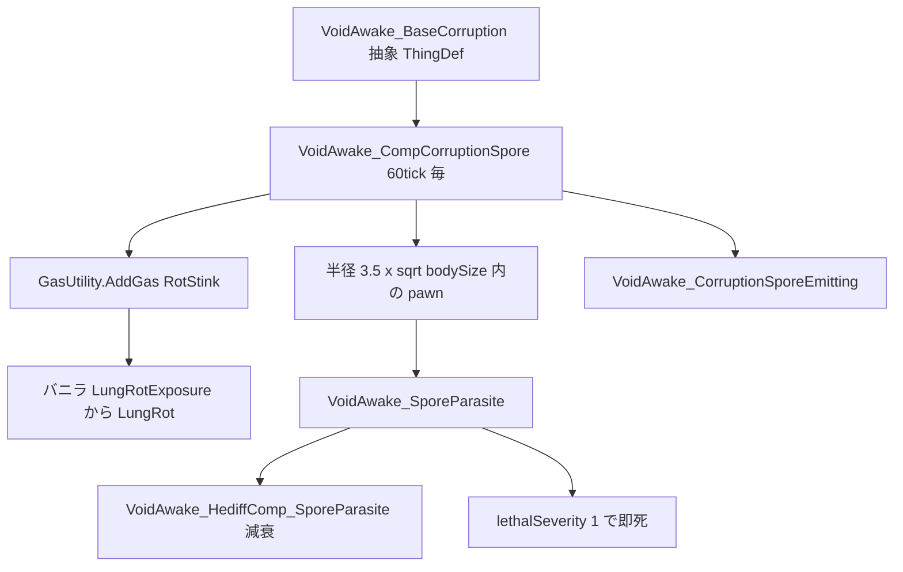
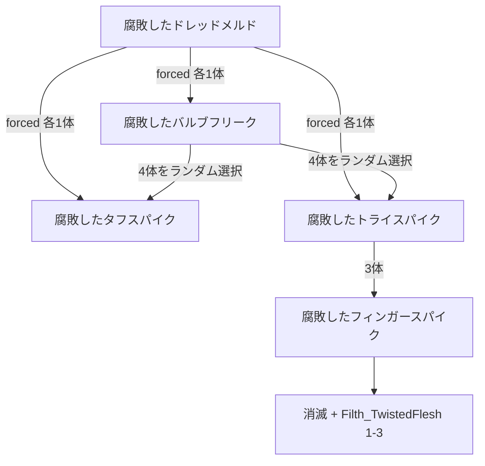

# コラプション / 腐敗の胞子 解説

> 数値と挙動を通しで読める仕様書は [`Corruption_Spec.html`](Corruption_Spec.html)（ブラウザで開ける単一ファイル）。
> こちらは実装メモとして、ファイル構成と設計意図を中心に扱う。

## 一言でいうと

バニラのフレッシュビースト4種とドレッドメルドを**腐敗変異**させたアノマリー群。個体性能・攻撃・収容設定はバニラのコピーだが、**分裂先が腐敗種同士で閉じている**点と、全個体が常時**腐敗の胞子**を撒いて周囲に**肺腐敗病**と致死性の**胞子寄生**を広げる点が異なる。

---

## 全体構成

| 役割 | パス |
|------|------|
| 種族（抽象 + 6体） | [`Defs/ThingDefs_Races/Races_Corruption.xml`](../Defs/ThingDefs_Races/Races_Corruption.xml) |
| PawnKind | [`Defs/PawnKindDefs/PawnKinds_Corruption.xml`](../Defs/PawnKindDefs/PawnKinds_Corruption.xml) |
| コーデックス | [`Defs/EntityCodexEntryDefs/EntityCodexEntries_Corruption.xml`](../Defs/EntityCodexEntryDefs/EntityCodexEntries_Corruption.xml) |
| 胞子寄生 Hediff | [`Defs/HediffDefs/Hediffs_CorruptionSpore.xml`](../Defs/HediffDefs/Hediffs_CorruptionSpore.xml) |
| 胞子の演出 | [`Defs/EffecterDefs/Effecters_CorruptionSpore.xml`](../Defs/EffecterDefs/Effecters_CorruptionSpore.xml) |
| 胞子の排出・寄生の進行 | [`VoidAwake_CompCorruptionSpore.cs`](../Source/VoidAwake/Entities/Corruption/VoidAwake_CompCorruptionSpore.cs) |
| 寄生の減衰・除去 | [`VoidAwake_HediffComp_SporeParasite.cs`](../Source/VoidAwake/Entities/Corruption/VoidAwake_HediffComp_SporeParasite.cs) |

C# は `Source/VoidAwake/Entities/Corruption/` に集約。Harmony パッチは使っておらず、すべて ThingComp / HediffComp で完結している。

---

## エンティティ一覧

全 6 体が抽象 def `VoidAwake_BaseCorruption`（親は バニラ `BaseFleshbeast`）を継承し、そこから胞子 comp と `ToxicEnvironmentResistance` 1 を受け取る。

| 個体 | 戦闘力 | 移動 | 体格 | 体力倍率 | 必要収容強度 | 胞子量/秒 | 寄生半径 |
|------|-------:|-----:|-----:|---------:|-------------:|----------:|---------:|
| 腐敗したフィンガースパイク | 25 | 5.1 | 0.6 | 0.5 | 20 | 60 | 2.7 |
| 腐敗したタフスパイク | 70 | 4.3 | 1 | 1 | 50 | 100 | 3.5 |
| 腐敗したトライスパイク | 90 | 4.3 | 1 | 0.3 | 40 | 100 | 3.5 |
| 腐敗した脳 | 150 | 2.6 | 1.4 | 2 | 90 | 140 | 4.1 |
| 腐敗したバルブフリーク | 360 | 3.8 | 3.5 | 0.3 | 75 | 350 | 6.5 |
| 腐敗したドレッドメルド | 650 | 1.5 | 5 | 10 | なし | 500 | 7.8 |

バニラとの差分がある箇所だけ拾うと以下の通り。

- **フィンガースパイク** — 休眠する（`CompProperties_CanBeDormant` / `CompProperties_WakeUpDormant`、起床半径 4.9、遅延 100〜200 tick）。人間にだけ反応し、建物・動物・メカには反応しない
- **タフスパイク** — 唯一 `canBecomeShambler` true。装甲 Sharp 0.2 / Blunt 0.16 を持つ
- **ドレッドメルド** — `CompDreadmeld` とボス扱い（`isBoss`、`forceDeathOnDowned`、`Regeneration` 常時付与）。出現時に `ThreatBig` のレター。死体から Shard 3 + Bioferrite 30。**収容関連の comp を持たない**
- **腐敗した脳** — 中身が未実装（後述の TODO）

### 分裂チェーン

腐敗種の分裂先は必ず腐敗種になっており、バニラのフレッシュビーストが混ざることはない。

タフスパイクと腐敗した脳には `deathAction` がなく、そのまま死体を残す。

---

## 腐敗の胞子

[`VoidAwake_CompCorruptionSpore`](../Source/VoidAwake/Entities/Corruption/VoidAwake_CompCorruptionSpore.cs) が 60 tick ごとに 2 つの仕事をする。撒く側の実装はここ一箇所だけで、6 体すべてが抽象 def 経由で同じ設定を共有している。

### ガス（肺腐敗病）

`GasUtility.AddGas(GasType.RotStink, amountPerEmission × bodySize)` を足元のセルへ流し込む。

**バニラの腐敗臭ガスをそのまま使う**のが要点で、独自ガスを定義していない。バニラ側には `RotStink` の濃度から `LungRotExposure` を進め、そこから `LungRot` へ繋ぐ連鎖（`HediffCompProperties_SeverityFromGas` / `HediffCompProperties_GiveHediffLungRot`）が既にあるので、肺腐敗病については **C# 側で hediff に一切触っていない**。ガスマスクや防毒対策がそのまま効くのもこのおかげ。

排出量が `bodySize` 比例なので、ドレッドメルド（500）とフィンガースパイク（60）で雲の広がり方に 8 倍以上の差が出る。

バニラの `CompProperties_ReleaseGas` は一回きりのバーストなので使えず、移動しながら撒き続けるために独自 comp が必要だった。

### 演出

[`VoidAwake_CorruptionSporeEmitting`](../Defs/EffecterDefs/Effecters_CorruptionSpore.xml) を毎 tick `EffectTick` する。`Fleck_ToxGasSmall` を緑（`0.45, 0.70, 0.30`）に着色し、`chancePerTick` 0.08 で薄く出す。

**環境音（`SubEffecter_Sustainer`）は意図的に入れていない。** コラプションは群れで湧く前提なので、1 体ずつ音を鳴らすと重なって耐えられなくなる。

Effecter は `PostDeSpawn` / `PostDestroy` の両方で `Cleanup()` する。死亡した pawn は `CanEmit` が false になり、その時点で片付ける。

---

## 胞子寄生

肺腐敗病だけでは「近づくと危ない」という圧が足りないので、逃げるしかない致死タイマーとして [`VoidAwake_SporeParasite`](../Defs/HediffDefs/Hediffs_CorruptionSpore.xml) を追加した。

### 進行と減衰

| 局面 | 挙動 |
|------|------|
| 胞子の中 | 60 tick ごとに severity +0.008。7500 tick（ゲーム内3時間）で 1.0 |
| 1.0 到達 | `lethalSeverity` 1 によりバニラの仕組みで即死 |
| 離脱直後 | `leaveGraceTicks` 120 tick は据え置き |
| 猶予後 | 1 時間あたり 0.1 減衰。満タンからは 10 時間で消滅 |
| 除去 | `removeBelowSeverity` 0.0001 を下回ったら hediff ごと削除 |

進行は撒く側（ThingComp）、減衰は付いた側（HediffComp）と役割を分けている。HediffComp 側は「最後に曝露した tick」だけを持ち、`NotifyExposed()` が来ない間は黙って減り続ける。この形なら複数のコラプションに同時に囲まれても二重進行にならず、どれか 1 体でも近ければ減衰が止まる。

段階は 0.25 / 0.5 / 0.75 で痛み 0.05 / 0.15 / 0.30 と呼吸 -0.10 / -0.25 / -0.40。**移動能力には手を付けていない**（唯一の対抗手段が「逃げる」なので、そこを潰すと詰みになる）。

治療は不可（`tendable` false）。抜け出す以外の解決手段はない。

### 半径判定にした理由

胞子の可視部分はバニラの `RotStink` ガスなので、素直に考えれば「ガス濃度が 0 より大きいセルにいたら進行」が見た目と一致する。しかしそれだと**放置した腐乱死体の腐敗臭でも寄生してしまい**、コラプションと無関係に入植者が死ぬ。バニラの挙動を壊すので却下した。

代わりに本体からの半径判定にしている。実効半径は `parasiteRadius × sqrt(bodySize)` で、ガスの排出量が `bodySize` 比例＝面積比例なら半径はその平方根、という考え方。`parasiteRadius` は抽象 def の 1 箇所（3.5）で全体を調整できる。

トレードオフとして、**風で流れたガスの端にいても寄生は進行しない**。見た目と判定にずれが出るのは承知の上。

### 耐性の判定順

`ExposureFactor(pawn)` が返す倍率をそのまま進行量に掛ける。

1. 装備または遺伝子に `immuneToToxGasExposure` があれば **0**（ガスマスク `Apparel_GasMask` が該当）
2. それ以外は `1 - ToxicEnvironmentResistance`（布マスク `Apparel_ClothMask` は 0.5 なので**進行半減**、3時間が6時間になる）

コラプション本体は抽象 def で `ToxicEnvironmentResistance` 1 を持つため倍率が 0 になり、自分や仲間の胞子では寄生されない。`gain <= 0` で早期 continue するので、severity 0 の hediff が付いて即消えるような無駄も起きない。

### 実装上の注意

severity が 1 に達した pawn は**その場で死んで `map.mapPawns.AllPawnsSpawned` から外れる**。列挙中にリストが変化するため、走査のたびに `tmpPawns` へスナップショットを取ってから回している。この点だけは痙縮ガス（`VoidAwake_CompSpasmGasRelease`）と実装が異なる（あちらは死なないので直接列挙している）。

---

## 未実装 / TODO

- **緑化テクスチャが未作成**。[`PawnKinds_Corruption.xml`](../Defs/PawnKindDefs/PawnKinds_Corruption.xml) の `texPath` と [`Races_Corruption.xml`](../Defs/ThingDefs_Races/Races_Corruption.xml) の `uiIconPath` がバニラのフレッシュビースト絵を直接参照したままで、見た目が原種と区別できない
- **腐敗した脳が実質空**。`body` はフィンガースパイク流用、`renderTree` と `uiIconPath` なし、テクスチャは仮素材 `UI/Entities/Test`、`deathAction` なし、固有能力なし。「群れを束ねる存在」という設定に対応する挙動が何もない
- **襲来イベントが未定義**。IncidentDef がなく、現状は Dev Mode のスポーンでしか出せない
- [`EntityCodexEntries_Corruption.xml`](../Defs/EntityCodexEntryDefs/EntityCodexEntries_Corruption.xml) の `uiIconPath` がバニラの `UI/CodexEntries/Fleshbeasts` と仮素材 `UI/Entities/Test` の流用
- 腐敗したタフスパイクに `deathAction` がない（バニラ準拠だが、腐敗種として分裂させるかは要判断）
- 腐敗したドレッドメルドに `Studiable` / `AttachPoints` / `MinimumContainmentStrength` がない。収容不可のままでよいか要判断
- **Languages / DefInjected が未整備**。日本語ラベルと説明文を Def へ直書きしている（英語環境では日本語が出る）
- 胞子寄生が半径判定なので、風下に流れたガスの見た目と判定範囲がずれる
- コラプション向けの収容脱走設定（`VoidAwake_ContainmentEscapeDef`）が未定義

---

## 数値まとめ（現行）

| 項目 | 値 |
|------|-----|
| 胞子の排出間隔 | 60 tick |
| 胞子の排出量 | `amountPerEmission` 100 × bodySize（60〜500） |
| ガス種別 | バニラ `GasType.RotStink`（腐敗臭ガス） |
| 肺腐敗病 | バニラの `LungRotExposure` → `LungRot` に委譲。独自処理なし |
| 演出 | `Fleck_ToxGasSmall` / 色 (0.45, 0.70, 0.30) / `chancePerTick` 0.08 / `positionRadius` 0.4 / `scale` 0.4〜0.9 |
| 演出の音 | なし（群れで鳴ると煩いため意図的に省略） |
| 寄生の判定 | 本体中心の半径 `parasiteRadius` 3.5 × sqrt(bodySize) |
| 実効半径 | フィンガースパイク 2.7 / タフ・トライ 3.5 / 脳 4.1 / バルブフリーク 6.5 / ドレッドメルド 7.8 |
| 寄生の進行 | 60 tick ごとに +0.008、7500 tick ≈ 3時間で 1.0 |
| 即死 | `lethalSeverity` 1 |
| 離脱猶予 | 120 tick |
| 寄生の減衰 | 1時間あたり 0.1（満タンから 10 時間で消滅） |
| 除去しきい値 | severity 0.0001 以下 |
| 段階 | 0.25 / 0.5 / 0.75 → 痛み 0.05 / 0.15 / 0.30、呼吸 -0.10 / -0.25 / -0.40 |
| 移動能力への影響 | なし（逃走手段を残すため） |
| 治療 | 不可（`tendable` false） |
| ガスマスク | `immuneToToxGasExposure` で完全無効 |
| 布マスク | `ToxicEnvironmentResistance` 0.5 で進行半減（3時間 → 6時間） |
| 本体の自己免疫 | 抽象 def の `ToxicEnvironmentResistance` 1 |
| 分裂 | ドレッドメルド → タフ+トライ+バルブ 各1 / バルブフリーク → 4体（タフ or トライ）/ トライスパイク → フィンガー 3体 / フィンガースパイク → 消滅 |
