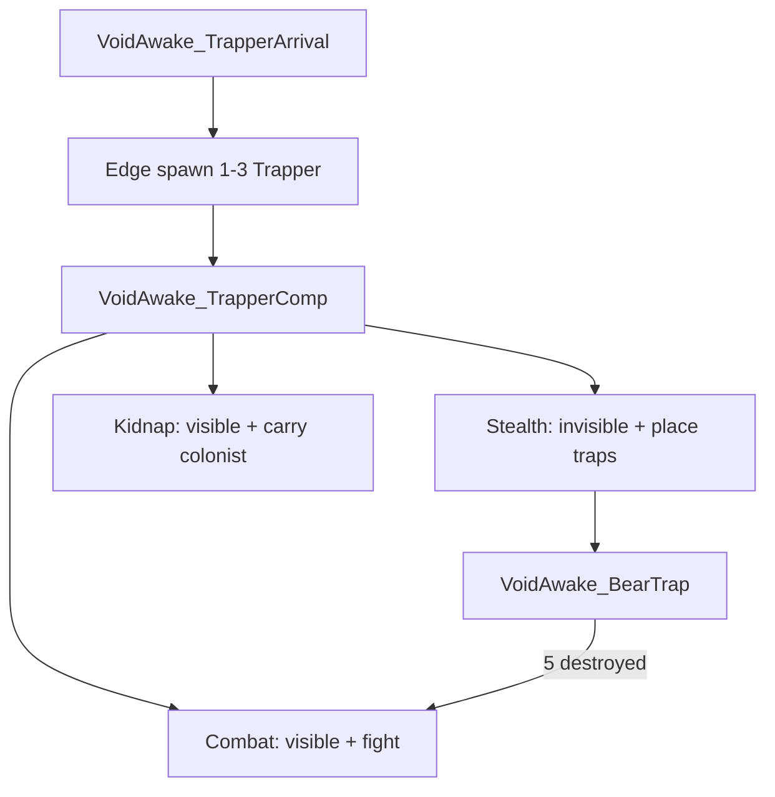
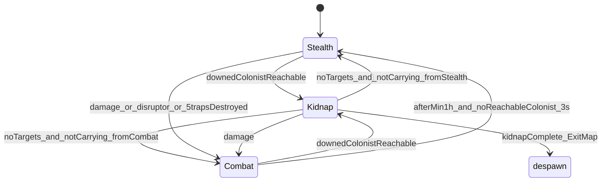
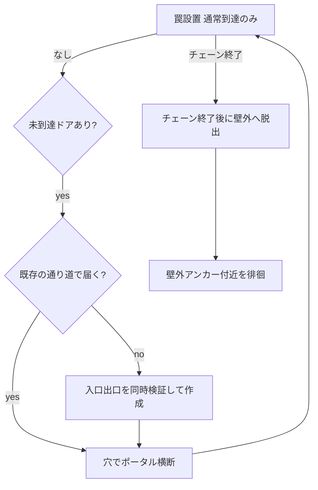
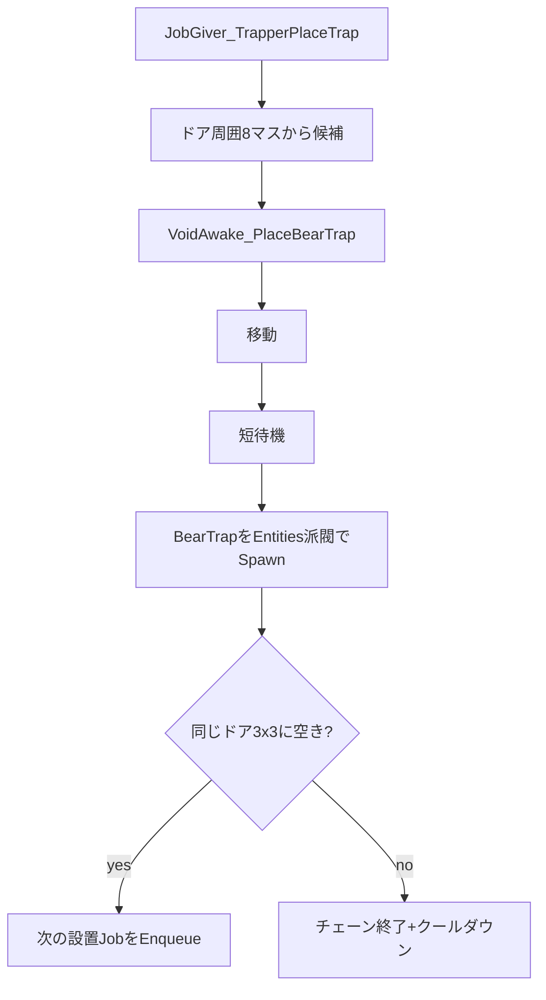
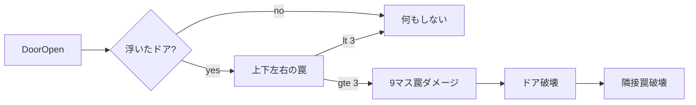

# Trapper システム解説

> 数値と挙動を通しで読める仕様書は [`Trapper_Spec.html`](Trapper_Spec.html)（ブラウザで開ける単一ファイル）。
> こちらは実装メモとして、ファイル構成と設計意図を中心に扱う。

## 一言でいうと

Sightstealer 風に**レターなしでマップ端から現れ**、**隠密中はコロニードア周りに熊罠を敷き**、条件を満たすと**可視化して戦闘**し、落ち着いたらまた隠密に戻る Anomaly エンティティ。

---

## 全体構成

| 役割 | パス |
|------|------|
| 種族 / PawnKind | [`Defs/ThingDefs/Entities/Trapper.xml`](../Defs/ThingDefs/Entities/Trapper.xml) |
| ThinkTree | [`Defs/ThinkTreeDefs/Trapper.xml`](../Defs/ThinkTreeDefs/Trapper.xml) |
| 状態・タイマー Comp | [`VoidAwake_TrapperComp.cs`](../Source/ClassLibrary1/Entitys/Basic/Trapper/VoidAwake_TrapperComp.cs) |
| 罠設置 AI | [`JobGiver_TrapperPlaceTrap.cs`](../Source/ClassLibrary1/Entitys/Basic/Trapper/JobGiver_TrapperPlaceTrap.cs) |
| 罠設置 Job | [`JobDriver_PlaceBearTrap.cs`](../Source/ClassLibrary1/Entitys/Basic/Trapper/JobDriver_PlaceBearTrap.cs) / [`Trapper_Job.xml`](../Defs/Trapper/Trapper_Job.xml) |
| 兎の通り道 | [`RabbitPassageUtility.cs`](../Source/ClassLibrary1/Entitys/Basic/Trapper/RabbitPassageUtility.cs) + [`RabbitPassage.xml`](../Defs/ThingDefs/Buildings/RabbitPassage.xml) |
| 熊罠 | [`BearTrap.xml`](../Defs/ThingDefs/Buildings/BearTrap.xml) + [`Building_VoidAwake_BearTrap.cs`](../Source/ClassLibrary1/Entitys/Basic/Trapper/Building_VoidAwake_BearTrap.cs) |
| 透明 Hediff | [`TrapperStealth.xml`](../Defs/HediffDefs/TrapperStealth.xml) |
| 拉致 Hediff | [`TrapperKidnapping.xml`](../Defs/HediffDefs/TrapperKidnapping.xml) |
| 拉致 AI / Job | [`JobGiver_TrapperKidnap.cs`](../Source/ClassLibrary1/Entitys/Basic/Trapper/JobGiver_TrapperKidnap.cs) / [`JobDriver_TrapperKidnap.cs`](../Source/ClassLibrary1/Entitys/Basic/Trapper/JobDriver_TrapperKidnap.cs) |
| 拉致レジストリ | [`GameComponent_VoidAwake_TrapperKidnaps.cs`](../Source/ClassLibrary1/Entitys/Basic/Trapper/GameComponent_VoidAwake_TrapperKidnaps.cs) |
| 襲来 Incident | [`Incidents_Trapper.xml`](../Defs/Storyteller/Incidents_Trapper.xml) + [`IncidentWorker_TrapperArrival.cs`](../Source/ClassLibrary1/Entitys/Basic/Trapper/IncidentWorker_TrapperArrival.cs) |
| Dev 起動 / 通り道デバッグ | [`DebugActions_Trapper.cs`](../Source/ClassLibrary1/Entitys/Basic/Trapper/DebugActions_Trapper.cs)（VoidAwake → Trapper arrival / Trapper: rabbit passage debug / Trapper: prune rabbit passages） |
| 妨害フレア連携 | [`Patch_TrapperStealth_DisruptInvisibility.cs`](../Source/ClassLibrary1/Entitys/Basic/Trapper/Patch_TrapperStealth_DisruptInvisibility.cs) |

---

## 状態マシン（中核）

状態は [`VoidAwake_TrapperComp`](../Source/ClassLibrary1/Entitys/Basic/Trapper/VoidAwake_TrapperComp.cs) の `TrapperCombatState`（`Stealth` / `Combat` / `Kidnap`）。ThinkTree は [`ThinkNode_ConditionalTrapperKidnap` / `Stealth` / `Combat`](../Source/ClassLibrary1/Entitys/Basic/Trapper/ThinkNode_ConditionalTrapperState.cs) で分岐。**Kidnap サブツリーが Stealth より先**に評価されるため、拉致中に罠設置 AI へ落ちない。

### Stealth（隠密）

- Hediff `VoidAwake_TrapperStealth`（`HediffCompProperties_Invisibility`、`visibleToPlayer` false）
- AI 優先順: 罠設置 → 壁外脱出 → 通り道使用 → 兎の通り道作成 → 壁外アンカー付近を徘徊。**使用が作成より先**なので既存の穴があればそれを通る。**積極戦闘なし**（`JobGiver_ReactToCloseMeleeThreat` のみ残る）
- 移動中は `footprintIntervalCells` = 2 マスごとに足跡 Fleck（`VoidAwake_TrapperFootstep` / `FootStep.png`）を残す
- 設置クールダウン `placeCooldownTicks` = 2500（約1時間）
- マップ上の罠設置数に上限はない（`maxTrapsOnMap` のような定数は未実装）

### Kidnap（拉致）

- 条件: Stealth または Combat 中（または Kidnap 再試行中）に **Downed 入植者**が通常到達 + 通り道経由で到達可能
- Hediff `VoidAwake_TrapperKidnapping`（移動 0.45 倍・運搬容量 +500・**可視**）
- AI: ThinkTree 上は `JobGiver_TrapperKidnap` のみ（罠設置は行わない）。**退出は同一 JobDriver 内**で通り道使用・掘削も行う
- フロー: 対象へ接近 → 運搬 → **ExitLoop**（下記）→ `GameComponent_VoidAwake_TrapperKidnaps` に登録 → `ExitMap`
- **ExitLoop**（[`TryPlanKidnapExitStep`](Source/ClassLibrary1/Entitys/Basic/Trapper/RabbitPassageUtility.cs)）:
  1. 通常到達でマップ端へ → 直接退出
  2. 不可なら既存通り道で外へ（`TryFindUsePassageTowardOutside`、多段ホップはループ）
  3. 自分のペア未所持かつ探索 OK なら **出口向け**新規ペアを掘削（`TryFindExitPassagePair`）
  4. それでも不可 → ジョブ失敗（担い中は finish action により kidnap クールダウンは抑制）
- Stealth 用 `TryFindPassagePair` は**未到達ドア向け**。Kidnap 退出用 `TryFindExitPassagePair` は**現在地からマップ端**向け（外周壁で閉じ込められても脱出可能）
- 対象は **Vanilla の kidnapped リストではなく独自レジストリ**（将来の救出イベント用）
- ジョブ失敗時: `kidnapRetryTicks` = 120 tick のクールダウン（`Notify_KidnapJobFailed`、同一失敗での多重設定は idempotent）
- 掘削探索失敗時: `passageSearchRetryTicks` = 600 tick（`Notify_PassageSearchFailed`）
- ジョブ開始時: 同一 tick 再割当防止のため +1 tick ブロック（`Notify_KidnapJobStarted`）
- 対象不在かつ非運搬中: `ExitKidnap()` で拉致開始前の状態へ復帰（Stealth 起点なら Stealth、Combat 起点なら Combat）
- マップ退出直前: `PrepareExitAfterKidnap()` で対象参照のみクリア。**Hediff は despawn まで維持**（退出失敗時も可視・低速のまま再試行可能）
- 被ダメージ: Combat へ（全 Trapper 交戦伝播）

---

## 兎の通り道（壁越えポータル）

通常歩行（`NoPassClosedDoors`）では届かないコロニードアがあるとき、壁を壊さず両側に穴を対で掘り、トラッパーだけが行き来する。

| 項目 | 内容 |
|------|------|
| 地形 | **人工床でなければ自然物**として許可（土・砂・砂利・泥・苔・採掘した岩の床）。建設床・カーペット・橋・水は不可 |
| 配置 | 壁を**まっすぐ挟んで向かい合う**入口・出口を作成前に両方確定。どちらか不可なら作らない |
| 壁の厚さ | 連続する壁は **4 枚まで**貫通可（`MaxWallThickness`）。二重壁・三重壁もそのまま 1 ペアで越える。5 枚以上や途中にドア等の非壁 Edifice があると不可 |
| 狭所除外 | 穴自体が不通行になるため、入口・出口ともに **空き隣接 2 マス以上**かつ**穴の先の連結空間 6 マス以上**（`HasUsableExitSpace`）。1〜2 マスの窪みや行き止まりには掘らない |
| 掘る位置 | 穴は不通行なので、トラッパーは入口の**隣のセル**（`FindDigStandCell`）から掘る。穴のセルに居るポーンは生成前に隣へ退避 |
| 再利用優先 | 掘る前に既存の穴を調べ、**マルチホップで目的ドアに届く通り道があれば新規に掘らない**（`CollectDoorsNeedingNewPassage` / `IsDoorServedByExistingPassages`）。距離制限なし |
| 上限 | **トラッパー1匹につき1ペア**（`HasOwnPassage`）。自分の穴が生きている間は絶対に掘らない。死亡時は `DestroyPassagesOwnedBy` で枠が空く |
| 自動整理 | `MapComponent_VoidAwake_TrapperTraps` が 2000 tick ごとに `PruneRedundantPassages` を実行。**相方を失った残骸・両端が徒歩で行き来できるペア・同じ2領域をつなぐ重複ペア**を削除（`PairId` の若い方を残す）。横断 Job 中のペアは対象外 |
| 探索 | 掘削が必要なドアだけを対象に、ドア側をフラッド（最大 3000 セル）し、その境界の壁から反対側の到達可能セルを探す。対象ドアは近い順に最大 4 件 |
| 再試行 | 失敗したら `passageSearchRetryTicks` = 600 tick は再探索しない |
| 移動 | 壁は残したまま。トラッパー専用 Job で入口 Touch → 出口脇へテレポート |
| 枚数 | 壁越え回数に上限なし（1 Think で 1 ペア） |
| 掘削タイミング | **設置クールダウンとは独立**。壁外で待機している間に掘って侵入路を用意する |
| 侵入タイミング | 通り道の使用は `CanPlaceTrapNow` のときだけ（＝罠作業があるときのみ中へ入る） |
| 寿命 | Stealth 中は残して使い回す（再侵入用）。**交戦突入でマップ上全削除**／死亡時は所有者の穴を削除 |
| 設置後 | チェーン終了で `wantsEscapeOutside` → 通り道で壁外へ → `waitAnchorCell` 付近をウロチョロ |

実装: [`RabbitPassageUtility.cs`](../Source/ClassLibrary1/Entitys/Basic/Trapper/RabbitPassageUtility.cs)、[`Building_VoidAwake_RabbitPassage.cs`](../Source/ClassLibrary1/Entitys/Basic/Trapper/Building_VoidAwake_RabbitPassage.cs)、`JobGiver_TrapperCreate/Use/Escape/WanderOutside`。

作れない理由の確認は Dev Mode → **VoidAwake → Trapper: rabbit passage debug**（未到達ドア数・既存の穴で足りているドア数・新規掘削が必要なドア数・出口候補数・狭すぎて却下された数・却下された地形 defName をログ出力）。

### Combat（交戦）

- 透明解除、可視化
- AI: `JobGiver_MetalhorrorFight` → 徘徊。**罠は置かない**
- 最低持続 `combatMinDurationTicks` = 2500（約1時間）。`EnterCombat()` のたびにタイマー更新
- 最低時間のあと、到達可能な入植者（人間・Downed 以外）が 0 の状態が `stealthReturnDelayTicks` = 180（約3秒）続くと Stealth 復帰
- 交戦突入時にマップ上の兎の通り道を全削除

### Stealth → Combat のトリガー

1. **被ダメージ** — Comp `PostPostApplyDamage`
2. **妨害フレア** — Harmony で `HediffComp_Invisibility.DisruptInvisibility` をフック
3. **マップ上の熊罠が累計5つ破壊**（作動破壊含む）— `MapComponent_VoidAwake_TrapperTraps` がカウントし、5で全 Trapper を交戦へ
4. **罠作動（Spring）** — `SpringSub` で全 Trapper を交戦へ
5. **浮いたドアコンボ発動** — 隣接罠3個以上で全 Trapper を交戦へ

いずれの場合も **1匹が交戦に入ると同マップの全 Trapper が交戦**（`RevealAllTrappersOnMap` → `ApplyEnterCombat`）。

---

## 罠設置フロー

- 対象: コロニー `Building_Door` の周囲 3×3（ドア自身除く8マス）
- 連続設置はそのドアの周囲内だけ（通路へ広がらない）
- 候補条件: Standable・既存罠なし・**通常到達可**・`CanReserve`（セル予約）。壁の向こうは通り道経由後に設置
- **障害物は除去して設置**: 植物（木・草）と岩塊などのアイテムはブロック扱いせず、設置直前に `ClearCellObstacles` で削除する。壁・ドア・建物（edifice）は従来どおり不可
- **ドア予約（Trapper 間）**: 設置開始時にドアを MapComponent で予約。他の Trapper は予約済みドアを選ばない。チェーン終了後も交戦/死亡まで保持
- セル予約失敗時はエラーログを出さない（`errorOnFailed: false`）

### 熊罠 `VoidAwake_BearTrap`

- `Building_TrapDamager` 相当（`TrapMeleeDamage` 80、作動で破壊）
- プレイヤー建築メニューには出ない（エンティティが `GenSpawn`）
- Trapper は PawnKind で `immuneToTraps`
- テクスチャ: `Textures/Entitys/Trapper/bearTrap.png`（`Cutout`、不透明）
- 草・苔・地表オーバーレイによるカモフラージュは**廃止**（罠はそのまま見える）

---

## 浮いたドアコンボ

壁に挟まれていない**浮いたドア**を狩るための罠連動。通常の壁付きドアには効果なし。

| 項目 | 内容 |
|------|------|
| 対象 | プレイヤー派閥の浮いたドア（cardinal 4マスの壁 ≤1、または standable ≥3） |
| カウント | ドアの上下左右のみ（対角は含めない） |
| 発動 | `Building_Door.DoorOpen` 時に隣接罠 **3個以上**（1〜2個は無効） |
| 効果 | ドア中心 3×3 のポーンに `TrapMeleeDamage`（Stab）→ ドア破壊 → 隣接罠全破壊 → **全 Trapper 交戦** |
| 紐 | 同じ浮いたドアの cardinal 罠同士を全ペアで紐描画（対面含む）。赤いグロー（太さ 0.34）＋黄白コア（0.16）の 2 重線を `MoteGlow` で描き、`MoteOverhead` 高度で脈動させる |
| 実装 | [`DoorTrapComboUtility.cs`](../Source/ClassLibrary1/Entitys/Basic/Trapper/DoorTrapComboUtility.cs) + [`Patch_Building_Door_DoorOpen.cs`](../Source/ClassLibrary1/Entitys/Basic/Trapper/Patch_Building_Door_DoorOpen.cs) |

コンボで壊れた罠も通常破壊と同様に `NotifyTrapDestroyed` へ加算される。

---

## 襲来イベント

- Def: `VoidAwake_TrapperArrival`（`hidden`、`baseChance` 0、レターなし）
- マップ端スポーン、脅威ポイントで 1〜3 体
- 起動方法:
  - Dev Mode → **VoidAwake → Trapper arrival**
  - Dev Mode → Incidents → Do incident (Map) → trapper arrival

---

## 数値まとめ（現行）

| 項目 | 値 |
|------|-----|
| 設置クールダウン | 2500 tick ≈ 1時間 |
| 足跡間隔（隠密移動） | 2 マス |
| 交戦最低時間 | 2500 tick ≈ 1時間 |
| 隠密復帰待ち（入植者不在後） | 180 tick ≈ 3秒 |
| マップ罠上限 | なし（未実装） |
| 破壊で交戦 | 5 |
| 襲来頭数 | points &lt; 400 → 1、&lt; 800 → 2、それ以上 → 3 |
| 罠ダメージ | TrapMeleeDamage 80 |
| 罠の透明度 | 不透明（Cutout） |
| 紐 | グロー 0.34 + コア 0.16、脈動 0.9〜1.25 倍 |
| 通り道の再探索待ち | 600 tick |
| 拉致ジョブ再試行待ち | 120 tick |
| 拉致運搬容量ボーナス | Hediff `CarryingCapacity` +500（[`TrapperKidnapping.xml`](../Defs/HediffDefs/TrapperKidnapping.xml) が単一ソース） |
| 通り道の上限 | トラッパー1匹につき 1 ペア |
| 通り道の自動整理 | 2000 tick ごと |
| 浮いたドアコンボ | 隣接罠 3個以上で 9マスダメージ + ドア/罠破壊 + 全交戦 |
| 交戦伝播 | 1匹が交戦 → 同マップの全 Trapper が交戦 |
| 兎の通り道 | 自然地形のみ・入口出口同時確定・壁 4 枚まで貫通・狭所は不可・1匹1ペア・既存があれば再利用優先・トラッパー専用ポータル |
| 設置後待機 | 壁外へ脱出後、外側アンカー付近を徘徊 |
