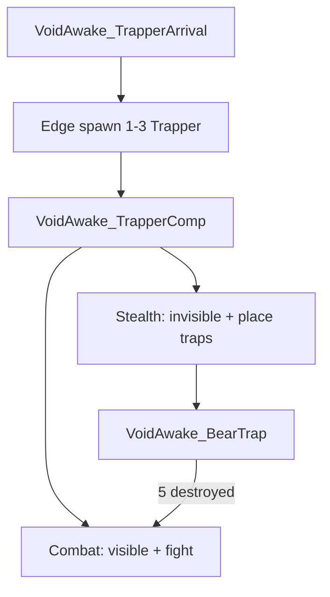
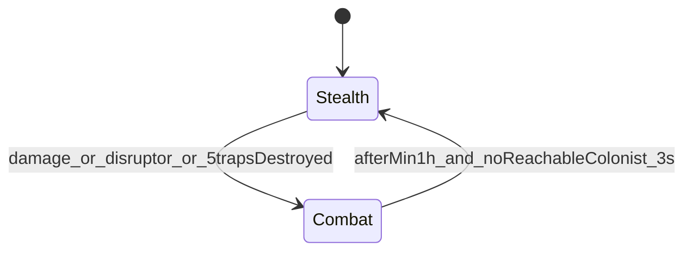
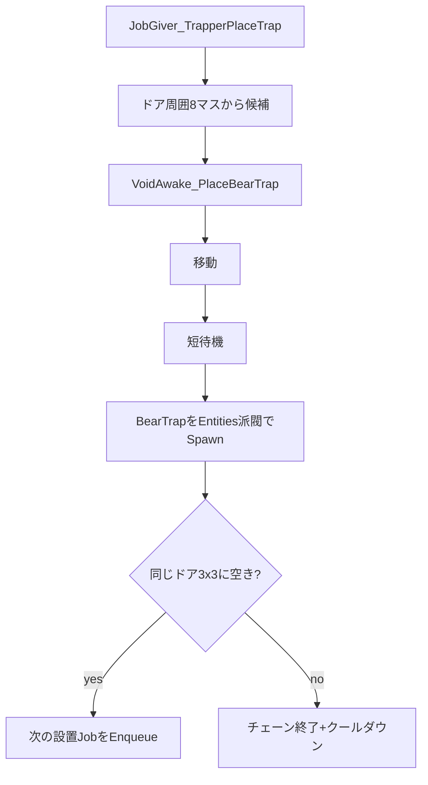

# Trapper システム解説

## 一言でいうと

Sightstealer 風に**レターなしでマップ端から現れ**、**隠密中はコロニードア周りに熊罠を敷き**、条件を満たすと**可視化して戦闘**し、落ち着いたらまた隠密に戻る Anomaly エンティティ。

---

## 全体構成

| 役割 | パス |
|------|------|
| 種族 / PawnKind | [`Defs/ThingDefs/Entities/Trapper.xml`](../Defs/ThingDefs/Entities/Trapper.xml) |
| ThinkTree | [`Defs/ThinkTreeDefs/Trapper.xml`](../Defs/ThinkTreeDefs/Trapper.xml) |
| 状態・タイマー Comp | [`VoidAwake_TrapperComp.cs`](../Source/ClassLibrary1/Entitys/Basic/Trapper/VoidAwake_TrapperComp.cs) |
| 罠設置 AI | [`JobGiver_TrapperPlaceTrap.cs`](../Source/ClassLibrary1/Entitys/Basic/Trapper/JobGiver_TrapperPlaceTrap.cs) |
| 罠設置 Job | [`JobDriver_PlaceBearTrap.cs`](../Source/ClassLibrary1/Entitys/Basic/Trapper/JobDriver_PlaceBearTrap.cs) / [`Trapper_Job.xml`](../Defs/Trapper/Trapper_Job.xml) |
| 熊罠 | [`BearTrap.xml`](../Defs/ThingDefs/Buildings/BearTrap.xml) + [`Building_VoidAwake_BearTrap.cs`](../Source/ClassLibrary1/Entitys/Basic/Trapper/Building_VoidAwake_BearTrap.cs) |
| 透明 Hediff | [`TrapperStealth.xml`](../Defs/HediffDefs/TrapperStealth.xml) |
| 襲来 Incident | [`Incidents_Trapper.xml`](../Defs/Storyteller/Incidents_Trapper.xml) + [`IncidentWorker_TrapperArrival.cs`](../Source/ClassLibrary1/Entitys/Basic/Trapper/IncidentWorker_TrapperArrival.cs) |
| Dev 起動 | [`DebugActions_Trapper.cs`](../Source/ClassLibrary1/Entitys/Basic/Trapper/DebugActions_Trapper.cs)（VoidAwake → Trapper arrival） |
| 妨害フレア連携 | [`Patch_TrapperStealth_DisruptInvisibility.cs`](../Source/ClassLibrary1/Entitys/Basic/Trapper/Patch_TrapperStealth_DisruptInvisibility.cs) |

---

## 状態マシン（中核）

状態は [`VoidAwake_TrapperComp`](../Source/ClassLibrary1/Entitys/Basic/Trapper/VoidAwake_TrapperComp.cs) の `TrapperCombatState`（`Stealth` / `Combat`）。ThinkTree は [`ThinkNode_ConditionalTrapperStealth` / `Combat`](../Source/ClassLibrary1/Entitys/Basic/Trapper/ThinkNode_ConditionalTrapperState.cs) で分岐。

### Stealth（隠密）

- Hediff `VoidAwake_TrapperStealth`（`HediffCompProperties_Invisibility`、`visibleToPlayer` false）
- AI: ドア周囲に罠 → なければ徘徊。**積極戦闘なし**（`JobGiver_ReactToCloseMeleeThreat` のみ残る）
- 設置クールダウン `placeCooldownTicks` = 2500（約1時間）
- マップ罠上限 `maxTrapsOnMap` = 8

### Combat（交戦）

- 透明解除、可視化
- AI: `JobGiver_MetalhorrorFight` → 徘徊。**罠は置かない**
- 最低持続 `combatMinDurationTicks` = 2500（約1時間）。`EnterCombat()` のたびにタイマー更新
- 最低時間のあと、到達可能な入植者（人間・Downed 以外）が 0 の状態が `stealthReturnDelayTicks` = 180（約3秒）続くと Stealth 復帰

### Stealth → Combat のトリガー

1. **被ダメージ** — Comp `PostPostApplyDamage`
2. **妨害フレア** — Harmony で `HediffComp_Invisibility.DisruptInvisibility` をフック
3. **マップ上の熊罠が累計5つ破壊**（作動破壊含む）— `MapComponent_VoidAwake_TrapperTraps` がカウントし、5で全 Trapper を `EnterCombat`、カウントリセット

罠1つ作動しただけでは交戦にならない。

---

## 罠設置フロー

- 対象: コロニー `Building_Door` の周囲 3×3（ドア自身除く8マス）
- 連続設置はそのドアの周囲内だけ（通路へ広がらない）
- 候補条件: Standable・既存罠なし・到達可・`CanReserve`（複数 Trapper の予約衝突対策）
- 予約失敗時はエラーログを出さない（`errorOnFailed: false`）

### 熊罠 `VoidAwake_BearTrap`

- `Building_TrapDamager` 相当（`TrapMeleeDamage` 80、作動で破壊）
- プレイヤー建築メニューには出ない（エンティティが `GenSpawn`）
- Trapper は PawnKind で `immuneToTraps`
- テクスチャ: `Textures/Entitys/Trapper/bearTrap.png`

---

## 襲来イベント

- Def: `VoidAwake_TrapperArrival`（`hidden`、`baseChance` 0、レターなし）
- マップ端スポーン、脅威ポイントで 1〜3 体
- 起動方法:
  - Dev Mode → **VoidAwake → Trapper arrival**
  - Dev Mode → Incidents → Do incident (Map) → trapper arrival

---

## 数値まとめ（現行）

| 項目 | 値 |
|------|-----|
| 設置クールダウン | 2500 tick ≈ 1時間 |
| 交戦最低時間 | 2500 tick ≈ 1時間 |
| 隠密復帰待ち（入植者不在後） | 180 tick ≈ 3秒 |
| マップ罠上限 | 8 |
| 破壊で交戦 | 5 |
| 襲来頭数 | points &lt; 400 → 1、&lt; 800 → 2、それ以上 → 3 |
| 罠ダメージ | TrapMeleeDamage 80 |
