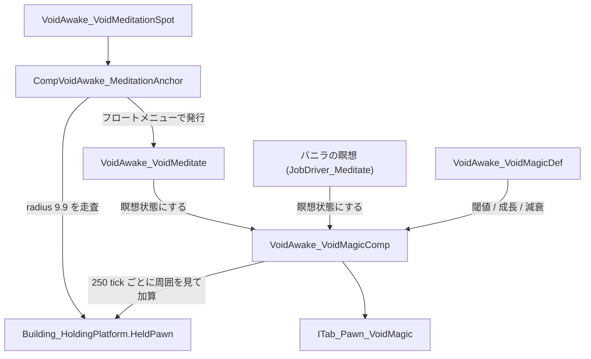
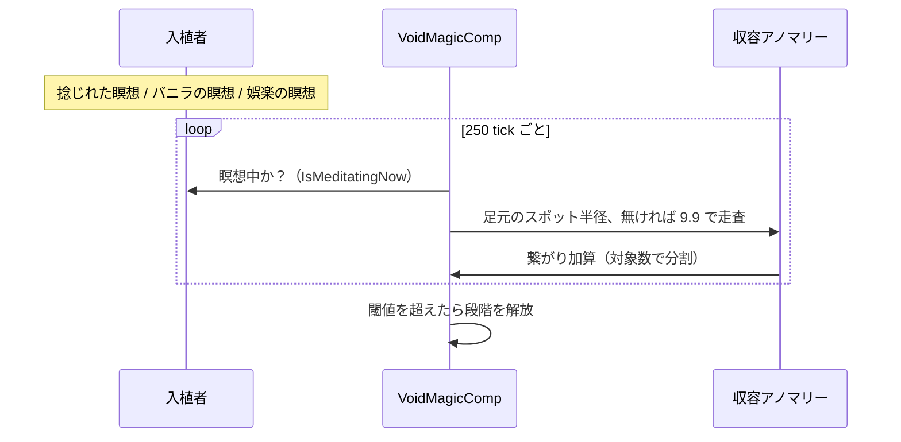

# VoidMagic（捻じれた魔術）システム解説

> 実装メモとして、ファイル構成と設計意図を中心に扱う。
> 現時点では**繋がりシステムのみ**が実装されており、段階（tier）に紐づく超能力の中身は空（ダミー）。

## 一言でいうと

収容したアノマリーの近くで**瞑想**すると、その入植者とアノマリー種の**繋がり**が伸びていき、閾値を超えるごとに段階が解放される。アノマリーを失う／瞑想を放置すると繋がりは減衰し、閾値を割ると段階を失う。進捗は入植者の専用タブ「捻じれた魔術」の横棒ゲージで確認できる。

---

## 全体構成



| 役割 | パス |
|------|------|
| 繋がりの定義（既定テンプレート） | [`Defs/VoidMagic/VoidMagicDefs.xml`](../Defs/VoidMagic/VoidMagicDefs.xml) / [`VoidMagicDef.cs`](../Source/ClassLibrary1/Core/VoidMagic/VoidMagicDef.cs) |
| Def 解決・アノマリー判定 | [`VoidMagicUtility.cs`](../Source/ClassLibrary1/Core/VoidMagic/VoidMagicUtility.cs) |
| 入植者ごとの繋がり保存・減衰・段階付与 | [`VoidAwake_VoidMagicComp.cs`](../Source/ClassLibrary1/Core/VoidMagic/VoidAwake_VoidMagicComp.cs) |
| 瞑想スポット | [`VoidMeditationSpot.xml`](../Defs/ThingDefs/Buildings/VoidMeditationSpot.xml) + [`Building_VoidAwake_VoidMeditationSpot.cs`](../Source/ClassLibrary1/Core/VoidMagic/Building_VoidAwake_VoidMeditationSpot.cs) |
| 半径スキャン・フロートメニュー | [`CompVoidAwake_MeditationAnchor.cs`](../Source/ClassLibrary1/Core/VoidMagic/CompVoidAwake_MeditationAnchor.cs) |
| 瞑想 Job | [`VoidMagic_Job.xml`](../Defs/VoidMagic/VoidMagic_Job.xml) + [`JobDriver_VoidMeditate.cs`](../Source/ClassLibrary1/Core/VoidMagic/JobDriver_VoidMeditate.cs) |
| 専用タブ UI | [`ITab_Pawn_VoidMagic.cs`](../Source/ClassLibrary1/Core/VoidMagic/ITab_Pawn_VoidMagic.cs) |
| comps / タブ / Royalty 連携パッチ | [`Patches/VoidMagicPatch.xml`](../Patches/VoidMagicPatch.xml) |
| Dev デバッグ | [`DebugActions_VoidMagic.cs`](../Source/ClassLibrary1/Core/VoidMagic/DebugActions_VoidMagic.cs)（VoidAwake → VoidMagic: add connection +25 / fill connection / clear connections / dump links） |
| 文言 | [`English`](../Languages/English/Keyed/VoidAwake_VoidMagic.xml) / [`Japanese`](../Languages/Japanese/Keyed/VoidAwake_VoidMagic.xml) + [`DefInjected`](../Languages/Japanese/DefInjected) |

---

## 対象アノマリーの決まり方

Def を 1 体ずつ書く必要はない。`VoidMagicUtility.IsLinkableEntityDef` が **`CompProperties_HoldingPlatformTarget` を持つ非人型 ThingDef** を収容可能アノマリーとみなし、`DefFor` が

1. `entityDef` 指定の `VoidAwake_VoidMagicDef` があればそれを使う
2. なければ既定テンプレート `VoidAwake_VoidMagicDefault` を使う

という順で解決する。つまり Anomaly DLC の収容可能エンティティは**追加作業なしで全種が対象**になる。人型を除外しているのは、シャンブラーやクリープジョイナーが `Human` ThingDef になり「human との繋がり」という表示になってしまうため。

個別に数値や段階を変えたい場合は、`entityDef` を指定した Def を追加するだけでよい。

```xml
<VoidAwake.VoidAwake_VoidMagicDef>
	<defName>VoidAwake_VoidMagic_Revenant</defName>
	<entityDef>Revenant</entityDef>
	<connectionPerHourMeditating>3</connectionPerHourMeditating>
	<tiers>
		<li>
			<label>faint resonance</label>
			<threshold>40</threshold>
		</li>
	</tiers>
</VoidAwake.VoidAwake_VoidMagicDef>
```

---

## 瞑想の流れ

加算は**ジョブではなく `VoidAwake_VoidMagicComp` 側**で行う。`CompTickRare`（≒250 tick ごと）で「その入植者が今瞑想しているか」を見て、周囲の収容アノマリーへ繋がりを配る。



- 瞑想の判定は `VoidMagicUtility.IsMeditationJob`。自前の `VoidAwake_VoidMeditate` に加えて、**`JobDriver_Meditate` を driverClass に持つジョブ全て**（バニラの `Meditate`、娯楽としての瞑想、Royalty のサイフォーカス瞑想、それらを継承した他 mod のジョブ）が対象。移動中は加算しない。
- 半径は足元に瞑想スポット（`CompVoidAwake_MeditationAnchor`）があればその `radius` / `gainMultiplier` を使い、無ければ `DefaultMeditationRadius` = 9.9。つまり**スポットが無くても収容所の近くで瞑想すれば伸びる**が、スポットを置けば倍率などを調整できる。
- スポット側のロジックは全て `CompVoidAwake_MeditationAnchor` に入っているため、**自前のスポットでもバニラの `MeditationSpot`（Royalty）でも同じように動く**。Royalty 側へは `Patches/VoidMagicPatch.xml` が `success=Always` で comp を差し込む（Royalty 未所持なら xpath が一致せず無視される）。
- 範囲内に対象が複数いる場合は獲得量を頭数で割るので、**1 体に絞った配置の方が速く伸びる**。
- 捻じれた瞑想ジョブは 60 tick ごとに範囲内の収容アノマリーを確認し、居なくなったらメッセージを出して中断する。
- 建物を選択すると半径リングを描画し、Inspect 欄に範囲内のアノマリー名を並べる。

---

## 減衰と段階

加算と同じ `VoidAwake_VoidMagicComp.CompTickRare`（≒250 tick ごと、経過 tick から日数換算するのでティック間隔に依存しない）で判定する。加算を先に行うため、瞑想中の繋がりが減ることはない。

- 対象種が**どのマップにも収容されていない**：`decayPerDayLost` で減衰（喪失）
- 収容中だが**最後の瞑想から `idleGraceDays` 経過**：`decayPerDayIdle` で減衰（放置）
- 収容中かつ猶予内：減衰なし（維持）

収容状況の判定は `VoidMagicUtility.ContainedEntityDefsNow()` が全プレイヤーマップの収容プラットフォームを 600 tick キャッシュで走査する。繋がりが 0 まで落ちた行はリストから削除され、タブから消える。

段階が上下すると `ApplyTierContent` が走り、解放済み段階の `abilities` / `hediff` を付与、失った段階のものを剥奪する。**現状は段階に中身が無いため実質何もしない**が、Def を埋めればそのまま機能する。段階の増減時は入植者に対してメッセージが出る。

---

## タブ UI

- `inspectorTabs` はバニラの `BasePawn`（`Data/Core/Defs/ThingDefs_Races/Races_Animal_Base.xml`）側で定義されているため、そこへ 1 行追加している。動物やメカにも付くが `IsVisible` が「Anomaly 有効 かつ プレイヤー操作の入植者 かつ comp 持ち」で絞るので表示されない。
- 行は「繋がりを持つアノマリー」＋「現在収容中のアノマリー」の合併。まだ 0 の収容アノマリーも行として出るので、これから伸ばせる対象が分かる。
- 横棒ゲージ上に各段階の閾値マーカーを描き、到達済みは黄色、未到達は灰色。右側に現在の段階名と状態（維持／喪失 -X/日／放置 -X/日／瞑想したことがない）を出す。
- 行のツールチップに段階一覧（未実装の能力は「能力は未実装」と表示）と成長・減衰の数値を出す。

---

## 数値まとめ

| 項目 | 値 | 備考 |
|------|----|------|
| 繋がり上限 | 100 | `maxConnection` |
| 瞑想での獲得 | 5.0 / 1時間 | `connectionPerHourMeditating`、2500 tick 換算。範囲内の対象数で分割 |
| 加算・減衰の判定間隔 | 250 tick | `VoidAwake_VoidMagicComp.UpdateIntervalTicks` |
| 捻じれた瞑想 1 回の長さ | 2500 tick（約1時間） | `JobDriver_VoidMeditate.MeditateTicks` |
| スポットの検出半径 | 9.9 セル | `CompProperties_VoidAwake_MeditationAnchor.radius` |
| スポット無しの検出半径 | 9.9 セル | `VoidMagicUtility.DefaultMeditationRadius` |
| 喪失時の減衰 | 6.0 / 日 | `decayPerDayLost` |
| 放置の猶予 | 3 日 | `idleGraceDays` |
| 放置時の減衰 | 1.0 / 日 | `decayPerDayIdle` |
| 収容状況キャッシュ | 600 tick | `VoidMagicUtility.ContainedScanIntervalTicks` |
| 段階の閾値 | 25 / 50 / 75 / 100 | 微かな共鳴 / 共振 / 深き共鳴 / 同化。能力は未設定 |

---

## 未実装（拡張ポイント）

- 段階に紐づく超能力そのもの。`VoidMagicTier.abilities`（`AbilityDef` のリスト）と `hediff` を埋めれば、`VoidAwake_VoidMagicComp.ApplyTierContent` の付与・剥奪がそのまま動く。
- 繋がりのデメリット（Void 侵食・精神への影響）、研究前提、放射状（星座風）グラフ表示。
- 瞑想スポットの専用テクスチャ（現在はバニラの `Things/Building/Misc/PartySpot` を暫定利用）。
