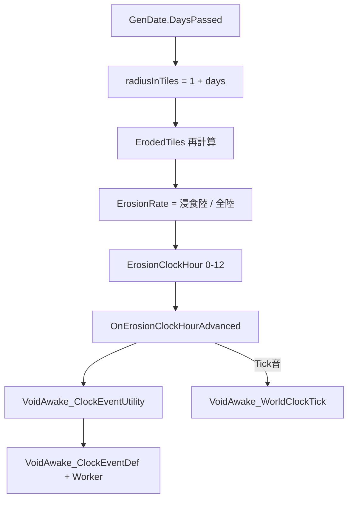

# WorldClock 仕様・システム・イベント追加方法

## 結論

WorldClock は独立システムではなく、[`VoidAwake_WorldComponent_VoidErosion`](../Source/VoidAwake/Systems/WorldErosion/VoidAwake_WorldComponent_VoidErosion.cs)（`WorldComponent`）の **浸食率 UI / 進行マイルストーン** である。針の「時」は `GenDate` の時刻ではなく、`floor(浸食率 × 12)` の離散値（0〜12）。

---

## 全体構成



| 役割 | ファイル |
|------|----------|
| 浸食・時計・UI | [`VoidAwake_WorldComponent_VoidErosion.cs`](../Source/VoidAwake/Systems/WorldErosion/VoidAwake_WorldComponent_VoidErosion.cs) |
| 時計イベント Def / Worker | [`VoidAwake_ClockEventWorker.cs`](../Source/VoidAwake/Systems/WorldErosion/ClockEvent/VoidAwake_ClockEventWorker.cs) / [`VoidAwake_ClockEventWorker_FixedHour.cs`](../Source/VoidAwake/Systems/WorldErosion/ClockEvent/VoidAwake_ClockEventWorker_FixedHour.cs) |
| イベント XML | [`ClockEvents_VoidAwake.xml`](../Defs/VoidAwake_ClockEventDefs/ClockEvents_VoidAwake.xml) |
| Tick 音 | [`Sounds_WorldClock.xml`](../Defs/SoundDefs/Sounds_WorldClock.xml) |
| テクスチャ | `Textures/UI/Interface/WorldClock/` |

マップ帯の `GameCondition`（Light〜Extreme）は時計イベントとは別系統（タイル距離比）。混同しない。

---

## 浸食の進行（針が進む前提）

1. **日替わり**で `radiusInTiles = StartRadius(1) + DaysPassed × TilesPerDay(1)`
2. 原点タイルから半径内のタイルを `ErodedTiles` に入れる
3. **浸食率** = 浸食された陸タイル数 / ワールド全陸タイル数
4. **時計の時** = `Clamp(Floor(ErosionRate × 12), 0, 12)`、針角度 = 時 × 30°

毎 `WorldComponentTick` で `TryFireClockHourEvent` が走り、`lastClockHour` より進んでいればスキップ分も含めて順に発火する。

---

## 時計が進んだときの処理

`OnErosionClockHourAdvanced(hour)`:

1. `VoidAwake_WorldClockTick` をカメラ再生
2. `VoidAwake_ClockEventUtility.TryFireRandomEvent(hour)`
   - 先に **固定枠**（`fixedHour == hour`）があれば実行
   - 続けて **ランダム枠**（レベル別重み抽選）を実行
   - 時 1 / 4 / 7 / 10 / 12 では両者が併発する

### 固定イベント（別枠）

| 時 | Def | Worker |
|----|-----|--------|
| 1 | `VoidAwake_ClockEvent_Fixed_Hour1` | `VoidAwake_ClockEventWorker_FixedHour1` |
| 4 | `VoidAwake_ClockEvent_Fixed_Hour4` | `VoidAwake_ClockEventWorker_FixedHour4` |
| 7 | `VoidAwake_ClockEvent_Fixed_Hour7` | `VoidAwake_ClockEventWorker_FixedHour7` |
| 10 | `VoidAwake_ClockEvent_Fixed_Hour10` | `VoidAwake_ClockEventWorker_FixedHour10` |
| 12 | `VoidAwake_ClockEvent_Fixed_Hour12` | `VoidAwake_ClockEventWorker_FixedHour12` |

- XML に `<fixedHour>N</fixedHour>` を付けると固定枠。ランダム候補からは除外される
- 実装ファイル: [`VoidAwake_ClockEventWorker_FixedHour.cs`](../Source/VoidAwake/Systems/WorldErosion/ClockEvent/VoidAwake_ClockEventWorker_FixedHour.cs)
- 発火時は `SendEventLetter()` でレター通知（label / description）。ゲームプレイ効果は `ExecuteFixedEvent` で後から追加

### 時 → イベントレベル

| 時 (hour) | レベル | 備考 |
|-----------|--------|------|
| 0 | なし | イベント発火しない |
| 1–3 | Lv1 | |
| 4–6 | Lv2 | |
| 7–9 | Lv3 | |
| 10–12 | Lv4 | |

同レベル内で `weight > 0` かつ `Worker.CanFire(hour)` の Def を重み付き抽選し、`TryExecute` を呼ぶ。候補が無いと警告ログのみ（現状 Lv2–4 の XML が空）。

### UI

- `WorldComponentOnGUI` で時計＋針を描画（設定 `showErosionRateUI`）
- 左ドラッグで位置保存、ホバーでフレーバー文言（時帯ごと）
- **右クリック**で浸食基点タイルへワールドカメラをジャンプ（基点が無いときはメッセージ）
- 文言は [`Languages/*/Keyed/VoidAwake_WorldClock.xml`](../Languages/Japanese/Keyed/VoidAwake_WorldClock.xml)

---

## イベント追加手順

### 1. Worker クラスを追加

[`VoidAwake_ClockEventWorker.cs`](../Source/VoidAwake/Systems/WorldErosion/ClockEvent/VoidAwake_ClockEventWorker.cs) と同名前空間（または別ファイル）に:

```csharp
public class VoidAwake_ClockEventWorker_MyEvent : VoidAwake_ClockEventWorker
{
    public override bool CanFire(int hour) => true; // 任意の前提条件

    public override void TryExecute(int hour)
    {
        // ゲームプレイ処理
        SendEventLetter(); // label / description からレター
    }
}
```

- `CanFire`: 研究・ストーリーテラー・マップ有無などで除外
- `SendEventLetter`: タイトル=`def.LabelCap`、本文=`description`（空なら定型文）

プレースホルダー実装は `VoidAwake_ClockEventWorker_Placeholder`（レター＋ログのみ）。

### 2. XML Def を追加

[`Defs/VoidAwake_ClockEventDefs/ClockEvents_VoidAwake.xml`](../Defs/VoidAwake_ClockEventDefs/ClockEvents_VoidAwake.xml) に:

```xml
<VoidAwake.VoidAwake_ClockEventDef>
  <defName>VoidAwake_ClockEvent_L2_MyEvent</defName>
  <label>イベント名</label>
  <description>レター本文</description>
  <level>2</level>
  <weight>1</weight>
  <workerClass>VoidAwake.VoidAwake_ClockEventWorker_MyEvent</workerClass>
</VoidAwake.VoidAwake_ClockEventDef>
```

- `level` は厳密一致（Lv1 Def は hour 1–3 のときだけ候補）
- `weight` が大きいほど同レベル内で選ばれやすい
- DefDatabase 自動登録のため、追加登録コードは不要

### 3. 動作確認の目安

- 浸食率が次の 1/12 を跨いだタイミングで発火（通常は日進行後の半径拡大時）
- セーブ跨ぎや複数時間ジャンプは `lastClockHour+1 … hour` を順に処理
- 同レベルに複数 Def があれば重み抽選

既存サンプル: `VoidAwake_ClockEvent_TestA` / `L1_Whisper`（どちらも Lv1 + Placeholder）。

---

## 開発時の注意

- 時計の「時」≠ ゲーム内の時刻。**陸の浸食割合**が駆動源
- Lv2–4 の Def が無いと該当 hour で警告のみ
- マップ浸食帯の効果は `VoidConditions` + `ErosionLevel1–4` 側（時計イベントとは別）
- VoidProtect（浄化タイル）は現状描画寄りで、浸食再計算では未使用
